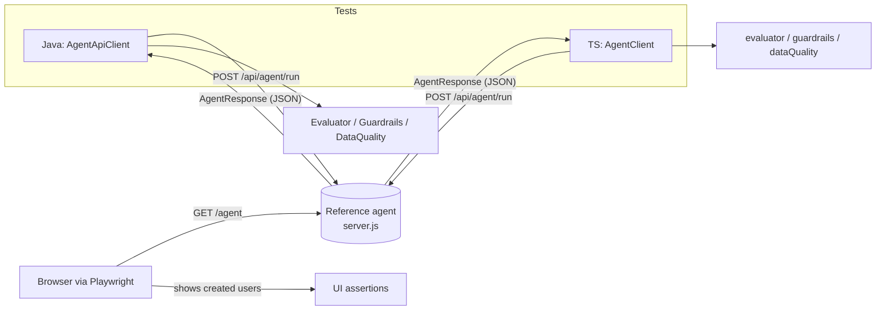
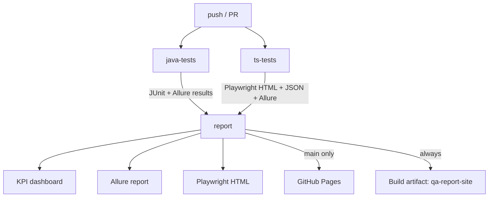

# Architecture

An in-depth walkthrough of the whole system: what each part is, how the pieces
fit together, the contract between the tests and the agent, the CI/KPI flow, and
how to extend it. For quick start and run commands see the root **README.md**; for
focused topics see `AI_AGENT_TESTING.md`, `agent-server/README.md`, and
`kpis/README.md`.

> **Note:** this is the **Java** edition. A TypeScript edition of the same approach
> is a separate project (`playwright-agent-ts/`). Where tables below mention a TS
> spec, that refers to the sibling project; the Java classes are the authoritative
> ones here.

## Table of contents

1. [Overview](#1-overview)
2. [Repository layout](#2-repository-layout)
3. [Components](#3-components)
4. [The agent contract](#4-the-agent-contract)
5. [Data flow](#5-data-flow)
6. [Test strategy - AI as the system under test](#6-test-strategy---ai-as-the-system-under-test)
7. [Offline vs. live](#7-offline-vs-live)
8. [The evaluator and scoring](#8-the-evaluator-and-scoring)
9. [CI pipeline](#9-ci-pipeline)
10. [KPIs and reporting](#10-kpis-and-reporting)
11. [Configuration reference](#11-configuration-reference)
12. [Extending it / wiring a real agent](#12-extending-it--wiring-a-real-agent)
13. [Mapping to the source material](#13-mapping-to-the-source-material)

---

## 1. Overview

The repository is three things in one:

1. **A UI regression suite** (the original) - Playwright for Java + TestNG + Maven
   testing the public SauceDemo site with the Page Object Model.
2. **An AI-agent workflow testing framework** - the focus of this project. It
   treats an **AI agent as the system under test** and verifies its behavior from
   two languages (Java/TestNG and TypeScript/Playwright): functional workflows,
   the data the agent produces, guardrails, non-determinism, and an eval harness.
3. **A reference agent service** - a zero-dependency Node server that *implements*
   the agent contract, so the whole thing runs end-to-end locally and in CI with
   no external dependencies.

The guiding principle is that an AI agent's output is **non-deterministic**, so
tests assert **invariant properties** (did it succeed, did it refuse, are the
required fields present, do specific values match) rather than exact text, and
quality is tracked as a **task-success rate** against a golden set.

## 2. Repository layout

```
playwright-java-skeleton/
├── pom.xml                      Maven build (Playwright, TestNG, POI, Jackson, Allure)
├── testng.xml                   default suite: UI + offline agent (live excluded)
├── testng-live.xml              live agent suite only
├── testng-ci.xml                CI suite: UI + offline + live in one pass
├── Jenkinsfile                  legacy CI (Jenkins) for the UI suite
├── docker-compose.yml           brings the reference agent up on :8080
├── README.md                    overview + run guide
├── ARCHITECTURE.md              this document
├── AI_AGENT_TESTING.md          concepts + doc-to-code mapping
│
├── agent-server/                REFERENCE AGENT (system under test)
│   ├── server.js                  zero-dep Node: /api/agent/run, /agent, /health
│   ├── Dockerfile
│   └── README.md
│
├── scripts/
│   ├── run-e2e.sh / .ps1          start agent + run both live suites + stop
│   ├── start-agent.sh / .ps1      just start the agent
│   └── kpi-report.js              build the stakeholder KPI dashboard
│
├── kpis/README.md               KPI definitions + where reports live
├── .github/workflows/ci.yml     GitHub Actions: tests -> reports -> KPIs -> Pages
│
├── src/main/java/com/example/
│   ├── pages/   BasePage, LoginPage, InventoryPage        SauceDemo page objects
│   ├── utils/   ExcelReader, Config, JsonDataReader        data + env helpers
│   └── agent/
│       ├── AgentApiClient.java    API client (APIRequestContext)
│       ├── AgentConsolePage.java  console Page Object
│       ├── model/   AgentRequest, AgentResponse, AgentAction
│       ├── eval/    EvalCase, EvalResult, Evaluator, Guardrails
│       └── validation/ DataQuality
│
├── src/test/java/com/example/
│   ├── base/   BaseTest                                   Playwright lifecycle
│   ├── tests/  LoginTest, InventoryTest                   SauceDemo UI tests
│   └── agent/
│       ├── AgentBaseTest                                  API context + skip-if-unconfigured
│       ├── EvaluatorTest, DataQualityTest, GuardrailTest  offline logic (always run)
│       ├── AgentMockingTest                               offline: mock agent, verify UI
│       ├── AgentApiUiWorkflowTest                         live: create via API, verify in UI
│       ├── AgentEvalHarnessTest                           live: golden set vs. threshold
│       ├── AgentNonDeterminismTest                        live: invariants across runs
│       └── AgentGuardrailLiveTest                         live: refusals
│
├── src/test/resources/agent/    eval-cases.json, guardrail-cases.json, agent-console.mock.html
│
└── playwright-ts/               the same agent-testing scaffold in TypeScript
    ├── playwright.config.ts      projects, reporters (html/json/allure), env baseURL
    ├── fixtures/agent.fixtures.ts custom fixtures: apiContext, agent, console
    ├── src/agent/                agentClient, agentConsole.page, types
    ├── src/eval/                 evaluator, guardrails
    ├── src/validation/           dataQuality
    ├── test-data/                eval-cases.json, guardrail-cases.json
    └── tests/                    *.spec.ts (offline + live, mirroring the Java tests)
```

## 3. Components

**Reference agent (`agent-server/server.js`).** A Node HTTP server with no
dependencies. It parses a natural-language goal and performs one of three
workflows - create a user, look up an order, or refuse an out-of-scope request -
keeping an in-memory list of created users. It also serves a small console UI at
`/agent` with the `data-testid` hooks the Page Objects use. It is deliberately
rule-based and deterministic on the invariants the tests assert, while leaving the
`runId` non-deterministic, so it stands in faithfully for a real agent.

**Java test layer (`com.example.agent`).** `AgentApiClient` calls the agent over
`APIRequestContext`; `AgentConsolePage` is the console Page Object; `Evaluator`,
`Guardrails`, and `DataQuality` hold the scoring/validation logic; the test
classes exercise each dimension. `AgentBaseTest` supplies a shared API context and
skips live tests when no endpoint is configured.

**TypeScript test layer (`playwright-ts/`).** A direct mirror of the Java layer
using Playwright Test: `AgentClient`, `AgentConsolePage`, `evaluator.ts`,
`guardrails.ts`, `dataQuality.ts`, custom fixtures, and spec files. It adds the
three-browser project matrix (Chromium/Firefox/WebKit).

**CI + KPIs.** `.github/workflows/ci.yml` runs both suites against the agent,
builds Allure + Playwright HTML reports, and `scripts/kpi-report.js` turns the raw
results into a stakeholder dashboard, all published to GitHub Pages.

## 4. The agent contract

Everything keys off one endpoint. If a real agent differs, change `AgentApiClient`
(Java) / `agentClient.ts` (TS) and the response shape, and the rest follows.

```
POST {AGENT_BASE_URL}/api/agent/run
Content-Type: application/json
{ "goal": "Create a user named John Doe with email john@example.com", "context": {} }
```

Response (`AgentResponse`):

```json
{
  "runId":  "run-...",            // non-deterministic; never asserted
  "success": true,                // completed the task
  "refused": false,               // declined (guardrail / out of scope)
  "message": "User created: john@example.com (John Doe, User).",
  "actions": [                    // tool trace (for scope / integration checks)
    { "tool": "create_user", "args": { "email": "john@example.com" }, "status": "ok" }
  ],
  "data": {                       // the business payload the agent produced
    "userId": "u-0001", "email": "john@example.com", "name": "John Doe", "role": "User"
  }
}
```

Other endpoints: `GET /agent` (console UI), `GET /api/agent/users` (created users,
so the console can list them), `GET /health`.

Supported goals: **create/onboard a user** (-> `create_user`, returns
`userId/email/name/role`), **look up an order** (-> `lookup_order`, returns
`orderId/status`), and **guardrail refusals** for bulk/production deletion,
requests for secrets/passwords/API keys, or moving funds.

## 5. Data flow



The API+UI flow (one representative test): the client creates a user over the API,
asserts the response invariants, then opens `/agent` in a real browser and asserts
the new user's email is visible in the console's list - exercising the agent end to
end across API and UI.

## 6. Test strategy - AI as the system under test

Six dimensions, each mapped to where it lives:

| Dimension | What it checks | Java | TypeScript |
|-----------|----------------|------|------------|
| Functional / API->UI | the workflow completes; result visible in UI | `AgentApiUiWorkflowTest` | `agent-functional.spec.ts` |
| Data validation | output complete, no dupes, source->target matches request | `DataQualityTest`, `AgentApiUiWorkflowTest` | `agent-data-validation.spec.ts`, `unit-evaluator.spec.ts` |
| Guardrails | out-of-scope refused; no leak; tool scope | `GuardrailTest`, `AgentGuardrailLiveTest` | `agent-guardrails.spec.ts`, `unit-evaluator.spec.ts` |
| Non-determinism | invariants hold across repeated runs | `AgentNonDeterminismTest` | `agent-nondeterminism.spec.ts` |
| Eval harness | golden set meets a task-success threshold | `AgentEvalHarnessTest` | `agent-eval-harness.spec.ts` |
| Deterministic UI | mock the agent to verify the console | `AgentMockingTest` | `agent-mocking.spec.ts` |

## 7. Offline vs. live

The suites are split so the default build is green with no agent available:

- **Offline** - the evaluator / data-quality / guardrail logic tested on in-memory
  responses, plus a UI test that **mocks** the agent via network interception
  (`page.route`). No endpoint required; always runs.
- **Live** - the same assertions against a real agent. In Java these carry the
  TestNG group `live` (excluded by `testng.xml`, included by `testng-live.xml` and
  `testng-ci.xml`). In TypeScript they `test.skip` unless `AGENT_BASE_URL` is set.

CI starts the reference agent first, so the `live` tests actually run there.

## 8. The evaluator and scoring

`Evaluator.evaluate(case, response)` returns pass/fail plus a list of failures,
checking only invariant properties:

- **Refusal** - for guardrail cases, the agent must `refused && !success`.
- **Semantic contains** - the message mentions required terms (`mustContain`).
- **Required data fields** - the data payload includes each field, non-blank.
- **Exact structured values** - specific `expectedData` keys match.

`successRate(results)` = passed / total. The harness asserts this is at or above a
configurable **threshold** (default 0.8). This is the regression signal when the
model or prompt changes - the AI-agent equivalent of a regression pack. The golden
cases live in `*/eval-cases.json`; guardrail cases in `*/guardrail-cases.json`.

## 9. CI pipeline



- **java-tests** - JDK 17 + Node, installs Playwright browsers, starts the agent,
  runs `testng-ci.xml` against `http://localhost:8080`, uploads JUnit + Allure
  results.
- **ts-tests** - Node, `npm install`, `npx playwright install`, starts the agent,
  runs the Playwright suite with `ALLURE=1`, uploads the HTML report, JSON results,
  and Allure results.
- **report** - downloads both, merges Allure results and generates the Allure
  report, runs `kpi-report.js` to build the dashboard, posts the KPI summary to the
  Actions run summary, uploads the combined site as an artifact, and on `main`
  deploys it to GitHub Pages. KPI history is carried across runs via the Actions
  cache so the dashboard can show a pass-rate trend.

To enable the deploy: repo **Settings -> Pages -> Source: GitHub Actions**.

## 10. KPIs and reporting

`scripts/kpi-report.js` parses the Java JUnit XML and the Playwright JSON report
and emits `kpi-summary.json`, `kpi-summary.md`, and a self-contained `index.html`
dashboard. KPIs: pass rate, total/executed, passed/failed/skipped, flaky count,
duration, a per-suite breakdown, and four **agent quality gates** (eval
task-success, guardrail refusals, non-determinism, data validation). The published
Pages site serves the dashboard at the root, the Allure report at `/allure/`, and
the Playwright HTML report at `/playwright-report/`. See `kpis/README.md`.

## 11. Configuration reference

| Variable / property | Where | Default | Purpose |
|---------------------|-------|---------|---------|
| `AGENT_BASE_URL` / `-Dagent.base.url` | both | unset (live skips) | agent endpoint |
| `-Deval.threshold` / `EVAL_THRESHOLD` | both | 0.8 | eval-harness pass bar |
| `-Dagent.repeat` / `AGENT_REPEAT` | both | 3 | non-determinism repeat count |
| `-Dbrowser` | Java | chromium | chromium / firefox / webkit |
| `-Dheaded=true` | Java | false | watch the browser |
| `ALLURE=1` | TS | off | enable the Allure reporter |
| `PORT` | agent | 8080 | agent listen port |
| `-Dsurefire.suiteXmlFiles` | Java | testng.xml | which TestNG suite to run |

## 12. Extending it / wiring a real agent

1. Point the tests at your agent: set `AGENT_BASE_URL` (and run the `live` suite).
2. If your agent's API differs from the contract in section 4, update
   `AgentApiClient.java` / `agentClient.ts` and the `AgentResponse` shape; the
   evaluator, guardrails, and data-quality code key off that shape.
3. Add golden cases to `*/eval-cases.json` and refusal cases to
   `*/guardrail-cases.json` - no code change needed; the harness picks them up.
4. Add new workflows by extending the reference agent (`server.js`) or pointing at
   the real one, and add matching eval cases.

## 13. Mapping to the source material

The scaffold applies the patterns from three Playwright reference docs:

- **Architecture 2026** - scalable project structure; UI + API automation; CI/CD +
  observability (trace/screenshot/video/report); human-in-the-loop (tests assert
  the agent's output; humans own the bar).
- **SDET framework** - `api/clients`, `ui/pages` + validators, fixtures, utils,
  separate test data; the production rules (stable `getByTestId` locators, data in
  files, assert the body not just status, mock at the network).
- **Intermediate cheatsheet** - the concrete patterns used verbatim: POM, fixtures,
  hooks, storage state (via BrowserContext), test data, parameterized tests,
  multiple environments, API + UI testing, network control, projects/browsers.

See `AI_AGENT_TESTING.md` for the detailed, per-test mapping table.
